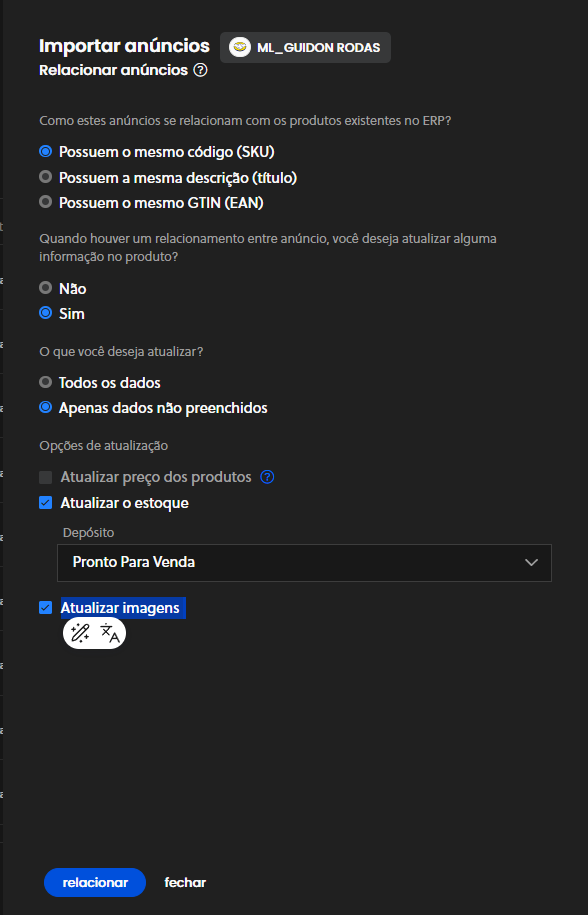
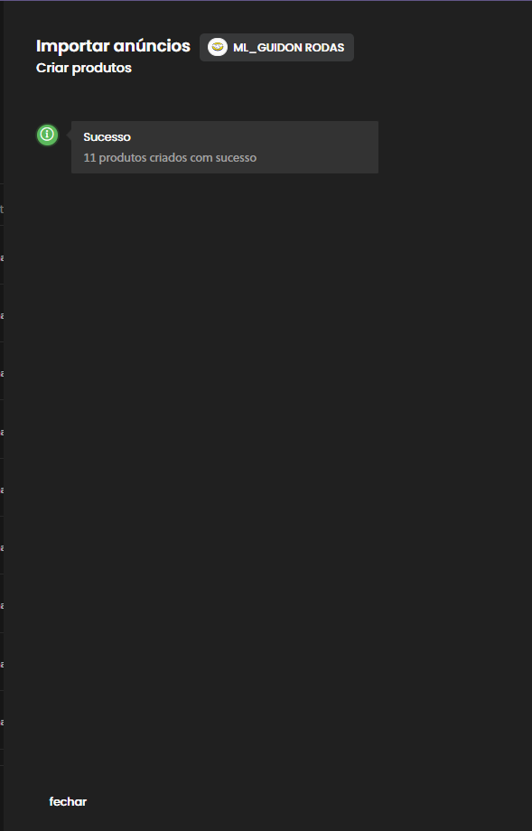

# Manual de Como Utilizar o Tiny

## **1. Introdução**

- **Objetivo da Apresentação** é de explicar como utilizar o Tiny de forma eficiente no fluxo de trabalho da empresa.

A idéia é mostrar o uso básico do Tiny pros novos usuários e pros antigos que tenham experiencia ou não com o sistema.

Na Guidon usamos o Tiny como forma de manter o controle de estoque, entrada e saida de material, geração e NF entre outras mas no nosso caso o uso do sistema é voltado **pra tentar manter da forma mais fiel possivel os produtos fisicos e a tabela-mãe**.

### Inteterface do Tiny: - Telas iniciais

Pra acessar o sistema deve-se ter usuário e senha. Eu Ivan já tenho vc deve solicitar seu acesso ou ao Alexandre ou ao TP

 

### Interface de Produtos no tiny:

No menu lateral vamos procurar a opção de cadastros -> Produtos

 

Uma vez Acessando o menu cairemos na tela de produtos. Essa tela reflete todos os produtos que estão armazenados podendo ou não ter um anúncio no Mercado Livre

### Buscanco produtos:

Você consegue fazer buscas no sitema por produtos utilizando formas diferentes de pesquisa as que mais são usadas são: Título(Descrição) e SKU.

#### Buscando por título:

Digite o título do produto com o filtro **palavra-chave** selecionado:

#### Buscando por sku:

Digite o título do produto com o filtro **código** ou **código(parcial)** selecionado:

**Uma observação é que em caso de busca por código o sku completo deve ser inserido do contrário, a busca não retornará nada**

-(guia) Padronizar os processos para garantir maior produtividade e organização.

### Já sei abrir o sistema, já sei pesquisar por produtos como q eu cadastro o produto?

O processo para cadastrar um produto é feito de duas forma:

**Inserção de produtos manualmente no sistema** e **Importação de produtos junto a plataforma do ML**

Devido a praticidade estamos fazendo isso pela segunda opção: Pegamos os  anúncios do mercado livre e trazemos ele pro sistema criando um produto com base nas características do anúncio.

### Passo a Paso

#### 1º Importando novos produtos

No canto superior clicamos no botão **receber do ecommerce**:

#### 2º Selecionando os produtos a serem importados

Uma vez clicado no botão vamos ter 3 opções para importação:

- todos os anúncios da minha conta
- somente os anúncios novos
- um anúncio específico

Temos usado o somente anúncios novos devido a demora da importação.

#### 3º Importando os produtos

Feito o passo anterior basta esperar a importação:

#### 4ª Relacionando transformando anúncios em produtos:

Os anúncios foram importado agora temos que transformar esses anúncios em produtos, para isso clique no botão **relacionar esses anuncios aos seus produtos**

Em seguida temos que estabelecer um critério para essa relação e a diretriz é relacionar com o **SKU**.

Como segunda seleção optamos por atualizar informações do produto caso ele já exista, então marca-se **sim** e como opções sequentes **Apenas dados não preenchidos**, **Atualizar o estoque** e **Atualizar imagens e seguimos com o relacionamento.
 **:

#### 5ª Criando novos produtos:

Ao fim do processo caimos finalmente na criação de novos produtos:

- Seguimos com **Criar produtos novos com base nos anúncios**

Na sequencia, basta criar os produtos com base nos anúncios.

 

Ao final do processo novos produtos serão criados.

---

## ah mas e agora?!

 
